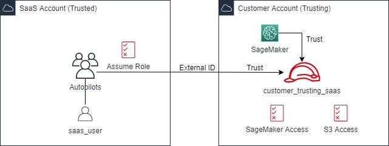
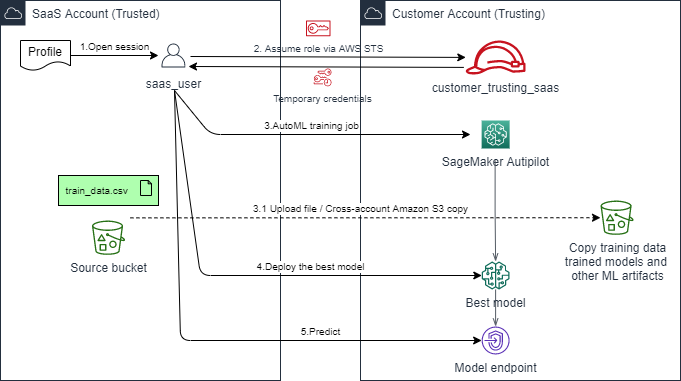

# Add AutoML functionality with Amazon SageMaker Autopilot across accounts

AutoML is a powerful capability, provided by Amazon SageMaker Autopilot, that allows non-experts to create machine learning (ML) models to invoke in their applications.

[`cross_account_autopilot_customer_churn_high_level.ipynb`](./cross_account_autopilot_customer_churn_high_level.ipynb) is an example of Autopilot applied in a cross account scenario, where the SageMaker resources are deployed in a customer (trusting) AWS account and are accessed from a SaaS (trusted) AWS account.

The notebook is divided into two sections:

* Create the AWS Identity and Access Management (IAM) resources needed for cross-account access
* Perform the Autopilot job, deploy the top model, and make predictions from the trusted account accessing the trusting account

## IAM resources

The following diagram illustrates the IAM entities which allow the cross-account implementation of the Autopilot job.

  

On the customer account the role `customer_trusting_saas` consolidates the permissions for [Amazon Simple Storage Service (Amazon S3)](https://aws.amazon.com/s3/) and SageMaker access needed for the following:

* The local SageMaker service that performs the Autopilot actions
* The principal in the SaaS account that initiates the actions in the customer account

The following resources are defined in the SaaS account:

- The `AutopilotUsers` group with the policy required to assume the `customer_trusting_saas` role via [AWS Security Token Service](https://docs.aws.amazon.com/STS/latest/APIReference/welcome.html) (AWS STS)
- The `saas_user`, which is a member of the `AutopilotUsers` group and is the actual principal triggering the Autopilot actions

In the cross-account trust relationship, the external ID mitigates the [confused deputy problem](https://docs.aws.amazon.com/IAM/latest/UserGuide/id_roles_create_for-user_externalid.html).

## Autopilot training job, deployment, and prediction overview

The training, deployment, and prediction process is illustrated in the following diagram.

  

The steps for the cross-account invocation are:

- Initiate a session as saas_user in the SaaS account and load the profile from the credentials
- Assume the role in the customer account via the AWS STS
- Set up and train the AutoML estimator in the customer account
- Deploy the top candidate model proposed by AutoML in the customer account
- Invoke the deployed model endpoint for the prediction on test data

# Security

See [CONTRIBUTING](CONTRIBUTING.md#security-issue-notifications) for more information.

# License

This project is licensed under the Apache-2.0 License.

